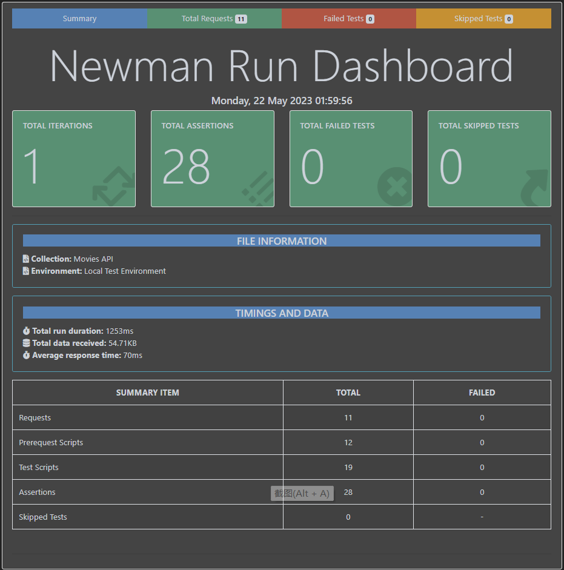

# Assignment 2 - Web API.

Name: [Qi Zeng]

## Features.

 + Feature 1 - Similar Movies: Get a list of similar movies for a movie.

 + Feature 2 - Actors: Get a list of Actors

 + Feature 3 - Add Actor to Favourites: Add a actor to actor favourites collection.

 + Feature 4 - TVs: Get a list of TVs.

 + Feature 5 -  Add TV to Favourites: Add a tv to TV favourites collection.

 + Feature 6 -  Similar TVs: Get a list of similar TVs for a TV.

 + Feature 7 -  Movie Reviews: Get a list of reviews for a moive.

  

## Installation Requirements

Install Mongoose for the Express app
```bat
npm install -save mongoose
```

get the App running
```bat
git clone https://github.com/IvanZeng/ewd-api-labs-2023.git
npm install
npm start
```


## API Configuration

Create a .env file at project root level and modify the variables as per your setup as mentioned in .env.template

```bat
NODE_ENV=development
PORT=8080
HOST=localhost
TMDB_KEY=***********************
DATABASE_URL=mongodb://127.0.0.1:27017/movies_db
DATABASE_DIALECT=mongo
TEST_DATABASE_URL=mongodb://127.0.0.1:27017/test_movies_db
JWT_SECRET_KEY=****
```


## API Design

|  |  GET | POST | PUT | DELETE
| -- | -- | -- | -- | -- 
| /api/accounts |Get all accounts | save account | N/A | N/A |
| /api/accounts/:id | Get a account base on id | Update the account based on id | N/A | N/A |
| /api/accounts/security/token | N/A | validate account based on email | N/A | N/A |
| /api/accounts/:id/favorites | get favorites based on user id | saved favorites based on user id | N/A | N/A |
| /api/genres/ | Get all genres  | N/A | N/A | N/A |
| /api/movies/ | Get a list of movies | N/A | N/A | N/A |
| /api/movies/:id/similar | Get a similar list base on movie id | N/A | N/A | N/A |
| /api/accounts/:id/favourites | N/A | save movie to favourites  | N/A | N/A |
| /api/actors/ | Get a list of actors | N/A | N/A | N/A |
| /api/accounts/:id/favourite_actors | N/A  | save actor to favourites | N/A | N/A |
| /api/tv/ | Get a list of TVs | N/A | N/A | N/A |
| /api/tv/:id/similar | Get a list of similar TVs base on TV id | N/A | N/A | N/A |
| /api/accounts/:id/favourite_tv | N/A | save TV to favourites | N/A | N/A |
| /api/movies/:id/reviews | Get a list of reviews for a movie | N/A | N/A | N/A |
| ... | ... | ... | ... | ...


## Security and Authentication
The API's are locked down by an authentication header. 
```bat
    router.route('/').get(accountsController.verify, accountsController.listAccounts);
    router.route('/').post(validationController.validateAccount, accountsController.createAccount);
    router.route('/:id').get(accountsController.verify, accountsController.getAccount);
    router.route('/:id').put(accountsController.updateAccount);
    router.route('/:id/favourites').post(accountsController.addFavourite);
    router.route('/:id/favourites').get(accountsController.verify, accountsController.getFavourites);
    router.route('/security/token').post(accountsController.authenticateAccount);
    router.route('/:id/favourite_actors').post(accountsController.addFavouriteActor);
    router.route('/:id/favourite_actors').get(accountsController.verify, accountsController.getFavouriteActors);
    router.route('/:id/favourite_tv').post(accountsController.addFavouriteTv);
    router.route('/:id/favourite_tv').get(accountsController.verify, accountsController.getFavouriteTv);
```
All other routes, except get list of actors and movies, are locked.


## Validation

Mongodb model for Account is validated using Joi.

Password setting:
```bat
const passwordRegex = /^(?=.*[0-9])(?=.*[a-z])(?=.*[A-Z]).{6,20}$/;
```


## Testing



## Integrating with React App

Integrated actor list and actor details page with Reace App

```bat
export const getActors = () => {
  return fetch(`/api/actors`)
    .then((response) => response.json());
};

export const getActor = (id) => {
  return fetch(`/api/actors/${id}`, {
    headers: {
      'Authorization': window.localStorage.getItem('token')
    }
  }).then((response) => response.json());
};
```

```bat
  useEffect(() => {
    getActors().then((response) => {
      console.log(response);
       setActors(response.results); 
     });
  }, []);

  useEffect(() => {
    getActor(id)
      .then((actor) => {
        setActor(actor);
      });
  }, [id]); 

```

## Extra features

. . Briefly explain any non-standard features, functional or non-functional, developed for the app.  

If you deployed to a hosting service/cloud, you should specify here. 

## Independent learning.

. . State the non-standard aspects of React/Express/Node (or other related technologies) that you researched and applied in this assignment . .  
